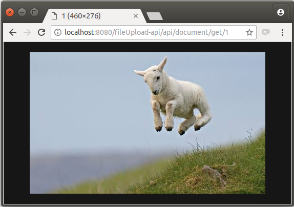

# Upload de Arquivos

[](https://github.com/GUMGA/frameworkbackend)

Em uma aplicação web é muito útil poder trabalhar com manipulação de arquivos, por isso vamos demonstrar como você pode fazer upload de arquivos na sua aplicação!

### GumgaFile

Essa é a principal classe para a representação de um arquivo dentro do sistema, ela define um tipo dentro do Framework, podendo ser mapeada pelo Spring como tal.
```Java
/*
 * To change this license header, choose License Headers in Project Properties.
 * To change this template file, choose Tools | Templates
 * and open the template in the editor.
 */
package io.gumga.domain.domains;
//imports
public class GumgaFile extends GumgaDomain {

    private String name;
    private long size;
    private String mimeType;
    private byte[] bytes;

    public GumgaFile() {
    }
    public GumgaFile(String name, long size, String mimeType, byte[] bytes) {
        this.name = name;
        this.size = size;
        this.mimeType = mimeType;
        this.bytes = bytes;
    }
    public GumgaFile(GumgaFile other) {
        if (other != null) {
            this.name = other.name;
            this.size = other.size;
            this.mimeType = other.mimeType;
            this.bytes = other.bytes;
        }
    }
//Getters and Setters
//Override
}
```
A imagem é representada por um array de *bytes*, e suas propriedades são armazenadas nos campos auxiliares (nome, tamanho e tipo)

No nosso projeto exemplo criamos uma entidade "Document" que possui um campo do tipo GumgaFile, vamos ver como podemos manipulá-lo.

### API para Arquivo
No nosso exemplo vamos criar uma API que receba um arquivo por requisição HTTP, e a partir daí crie um objeto *Document* persistido no banco de dados.<br>
Para isso precisamos mapear uma rota, que será a seguinte:
```
http://*servidor*/fileUpload-api/api/document/file
```
O método será declarado na classe *DocumentAPI*
```Java
@RequestMapping(method = RequestMethod.POST, value = "/file")
public String FileUpload(@RequestParam MultipartFile file) throws IOException {
    System.out.println("UPLOAD Arquivo");
    GumgaFile gf = new GumgaFile();
    gf.setBytes(file.getBytes());
    gf.setMimeType(file.getContentType());
    gf.setName(file.getName());
    gf.setSize(file.getSize());
    String fileName = gumgaTempFileService.create(gf);

    Document document = new Document();
    document.setFile(gf);
    documentService.save(document);
    document.getFile().setName(fileName);
    return document.getFile().getName();
}
```

>Ao gerar um projeto pelo Gumga GG uma série de métodos da API é criada para a manipulação de arquivos, inclusive métodos CRUD são sobrescritos na intenção de adequar o tratamento de arquivos nas requisições.

Uma vez declarado a rota, podemos fazer uma requisição com método POST, contendo um arquivo<br>
Usaremos o *Postman* para criar as requisições;<br>
A requisição deve conter um *form-data* com a chave "file" passando o arquivo desejado, veja no exemplo abaixo:


O servidor deverá responder com o nome do arquivo gerado.

A sequência de dados correspondente à imagem é gravada no banco de dados, agora podemos requisitar a visualização do arquivo.<br>
Para isso precisamos declarar um método que recebe o id do objeto *Document*, e retorna a sequência de bytes de maneira interpretável pelo navegador:
```Java
    @RequestMapping(value = "/get/{id}")
    public void getFile(@PathVariable Long id, HttpServletResponse httpServletResponse) throws IOException {
        GumgaFile file = documentService.view(id).getFile();
        httpServletResponse.reset();
        httpServletResponse.setContentLengthLong(file.getSize());
        httpServletResponse.setContentType(file.getMimeType());
        InputStream fis = new ByteArrayInputStream(file.getBytes());

        ServletOutputStream fos = httpServletResponse.getOutputStream();
        while (fis.available() > 0) {
            byte buffer[] = new byte[fis.available() > 4096 ? 4096 : fis.available()];
            fis.read(buffer);
            fos.write(buffer);
        }
        fos.close();
        fis.close();
    }
```
O método *getFile()* não é automaticamente gerado quando utilizamos o Gerador GG, criamos ele para podermos visualizar os arquivos retornados pelo servidor.

Considerando a rota implementada no método acima, e após registrar pelo menos um arquivo no sistema, podemos fazer uma requisição GET passando o id do objeto desejado!
> O id da classe *Document* é auto incrementado iniciando em 1

Como registramos uma imagem no sistema podemos entrar com a seguinte diretamente no navegador:
```
http://*servidor*/fileUpload-api/api/document/get/1
```




License
----

LGPL-3.0


**Free Software, Hell Yeah!**
