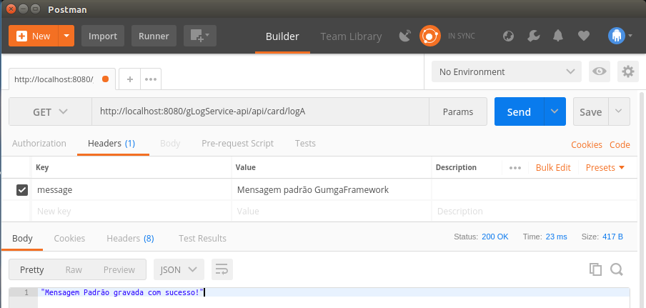
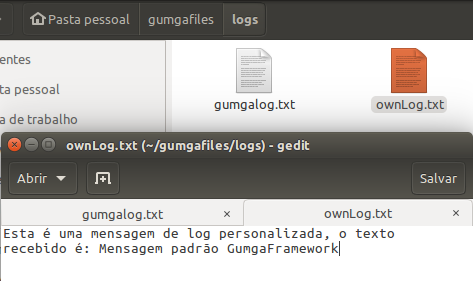

# Arquivo de Log

[](https://github.com/GUMGA/frameworkbackend)

O Gumga Framework possui uma funcionalidade destinada a registrar *logs* do sistema em um arquivo de texto.<br>
Por padrão diversas informações são armazenadas em log durante a execução de uma aplicação, porém nesse exemplo iremos demonstrar como utilizar os métodos da classe *GumgaLoggerService* para registrar nossos próprios logs em arquivo.

### GumgaLoggerService

Esta classe é um *Service* que pode ser injetado dentro dos seus Componentes
```java
/*
 * To change this license header, choose License Headers in Project Properties.
 * To change this template file, choose Tools | Templates
 * and open the template in the editor.
 */
package io.gumga.application;
//imports
@Service
public class GumgaLoggerService {

    private static final Logger log = LoggerFactory.getLogger(GumgaLogService.class);

    private final SimpleDateFormat sdf;

    @Autowired
    private GumgaValues gumgaValues;

    public GumgaLoggerService() {
        this.sdf = new SimpleDateFormat("yyyy-MM-dd HH:mm:ss.SSS");
    }
    public void logToFile(String msg, int level) {
        try {
            String line = createLogLine(msg, level);
            File folder = new File(gumgaValues.getLogDir());
            folder.mkdirs();
            File log = new File(folder, "gumgalog.txt");
            FileWriter fw = new FileWriter(log, true);
            fw.write(line);
            fw.close();
        } catch (IOException ex) {
            log.error("Problema ao loggar no arquivo", ex);
        }
    }
    public String createLogLine(String msg, int level) {
        StackTraceElement stackTraceElement = Thread.currentThread().getStackTrace()[level];
        String line = sdf.format(new Date()) + " " + stackTraceElement.getClassName() + " " + stackTraceElement.getMethodName() + " " + stackTraceElement.getLineNumber() + " " + msg + "\n";
        return line;
    }
}

```
O método *createLogLine(...)* cria uma mensagem de log formatada de acordo com a classe que está sendo executada, ele recebe como parâmetro uma String *msg* contendo a mensagem desejada, e o nível *(level)* da operação (como inteiro)
> O *int level* é o índice da *StackTrace* a ser registrado no log, devemos informar o número respectivo à chamada do método desejado

O retorno deste método é uma String com a seguinte composição:
```
data e hora + ClasseDeOrigem + NomeDoMetodoDeOrigem + LinhaDoMetodoDeOrigem + Mensagem
```

Este é o conteúdo que será gravado no arquivo, porém quem de fato faz a escrita é o método *logToFile(...)*. Este método busca as informações do usuário *(user.home)* para a criação do diretório onde o arquivo será gravado, por padrão este local é:
```
user.home/gumgafiles/logs
```
>Caso o arquivo já exista, uma nova linha é adicionada ao final do documento

### Exemplo

Criaremos uma rota na API para criação de um registro no arquivo passando uma mensagem no cabeçalho da requisição:

```java
@RequestMapping(value = "/logA", method = RequestMethod.GET)
public String fileLoggerStd(@RequestHeader String message){
    return cardService.stdLogWriter(message);
```
Chamamos o método *stdLogWriter(...)* passando a mensagem como parâmetro
```java
public String stdLogWriter(String message) {
    gumgaLoggerService.logToFile(message, 3);
    return "Mensagem Padrão gravada com sucesso!";
}
```

Passaremos a mensagem a ser gravada no cabeçalho da requisição com a chave "message". Segue o exemplo abaixo:



Podemos verificar no arquivo *"gumgalog.txt"* o conteúdo registrado!

```
2018-03-01 17:07:41.058 br.com.gLogService.application.service.CardService stdLogWriter 59 Mensagem padrão GumgaFramework
```
> Caso você já tenha executado aplicações Gumga Framework antes, provavelmente este arquivo estará com outros registros, e o seu estará no final do documento.<br>

>O diretório deste arquivo é **pastaDoUsuario/gumgafiles/gumgalog.txt**

Agora, podemos criar nossos próprios arquivos de registros com o conteúdo que desejarmos!<br>
Reescrevemos os métodos *logToFile(...)* e *createLogLine(...)* no Service para que possamos personalizar nossos registros

```java
public void logToFile_(String msg) {
    try {
        String line = createLogLine_(msg);
        File folder = new File(gumgaValues.getLogDir());
        folder.mkdirs();
        File log = new File(folder, "ownLog.txt");
        FileWriter fw = new FileWriter(log, true);
        fw.write(line);
        fw.close();
    } catch (IOException ex) {
        log.error("Problema ao loggar no arquivo", ex);
    }
}

public String createLogLine_(String msg) {
    String line = "Esta é uma mensagem de log personalizada, o texto recebido é: " + msg + "\n";
    return line;
}
```
Podemos observar o resultado gravado no arquivo *ownLog.txt*:




>Podemos escrever uma mensagem personalizada no arquivo *gumgalog.txt* também, sem nenhuma implicação

License
----

LGPL-3.0


**Free Software, Hell Yeah!**
