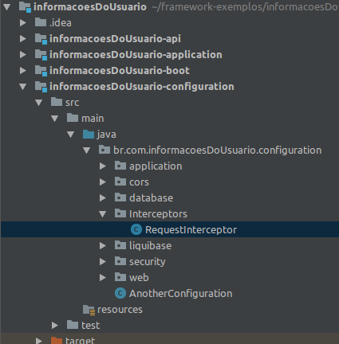

# Informações Adicionais do Usuário
## GumgaThreadScope

[](https://github.com/GUMGA/frameworkbackend)


Em um sistema web normalmente é necessário ler e transportar algumas informações a respeito do usuário requerinte da thread atual. Para isso o Gumga Framework fornece no seu escopo global a entidade *GumgaThreadScope* que mantém uma série de dados coletados da requisição recebida.

Segue com fim informativo o conteúdo dessa classe:
```java
public class GumgaThreadScope {

    /**
     * Oi da organização que criou a instância
     */
    public static final ThreadLocal<String> instanceOi = new ThreadLocal<>();
    /**
     * Ip da requisição
     */
    public static final ThreadLocal<String> ip = new ThreadLocal<>();
    /**
     * login do usuário da requisição
     */
    public static final ThreadLocal<String> login = new ThreadLocal<>();
    /**
     * nome organização do usuário da requisição
     */
    public static final ThreadLocal<String> organization = new ThreadLocal<>();
    /**
     * código da organização do usuário da requisição
     */
    public static final ThreadLocal<String> organizationCode = new ThreadLocal<>();
    /**
     * chave da operação da requisição
     */
    public static final ThreadLocal<String> operationKey = new ThreadLocal<>();
    /**
     * irá ignorar a checagem de propriedade dos registros do Tenacy
     */
    public static final ThreadLocal<Boolean> ignoreCheckOwnership = new ThreadLocal<>();
    /**
     * token da requisição
     */
    public static final ThreadLocal<String> gumgaToken = new ThreadLocal<>();

    /**
     * id do Software que fez a requisição
     */
    public static final ThreadLocal<String> softwareName = new ThreadLocal<>();

    /**
     * id da Organição que fez a requisição
     */
    public static final ThreadLocal<Long> organizationId = new ThreadLocal<>();

    /**0
     * perfis do usuario que está logado
     */
    public static final ThreadLocal<Map> authorizationResponse = new ThreadLocal<>();
    /**
        id do usuario que foi reconhecido
     */
    public static final ThreadLocal<String> userRecognition = new ThreadLocal<>();

}
```

Tecnicamente temos o "recipiente" necessário para receber uma série de dados em múltiplas threads, basta agora fazer as atribuições necessárias de acordo com a requisição.

Esses dados são coletados por um interceptor que filtra toda requisição recebida na API do sistema.
> O Gumga Framework possui um interceptor que faz a verificação de autenticidade junto ao módulo de Segurança, por isso alguns campos são destinados a receber as chaves de operações e perfis do usuário.

Para o nosso exemplo, iremos criar nosso próprio interceptor e fazer alguns testes.

#### Interceptando Requisições

Por questão de organização de dependências, devemos criar os interceptors no pacote "configuration", segue o exemplo:



Sobrescreveremos o método *preHandle()* herdado da entidade *HandlerInterceptorAdapter*, isso nos permitirá manipular as requisições conforme quisermos. Para nosso exemplo criamos apenas uma série de atribuições para o *GumgaThreadScope*.
```java
...
public class RequestInterceptor extends HandlerInterceptorAdapter {
    @Override
    public boolean preHandle(HttpServletRequest request, HttpServletResponse response, Object handler) throws Exception {
        GumgaThreadScope.gumgaToken.set(request.getHeader("token"));
        GumgaThreadScope.organizationCode.set(request.getHeader("oi"));
        GumgaThreadScope.login.set(request.getHeader("user"));

        System.out.println(GumgaThreadScope.gumgaToken.get());
        System.out.println(GumgaThreadScope.organizationCode.get());
        System.out.println(GumgaThreadScope.login.get());

        if (GumgaThreadScope.gumgaToken.get() == null) {
            response.sendError(403);
            System.out.println("");
            return false;
        }

        return super.preHandle(request, response, handler);
    }
}
```

> Observe que criamos um *if* que verifica se a requisição possui um valor de token, isso é um exemplo bem simples de como podemos filtrar o que será respondido pelo sistema

Considere que podemos ler qualquer dado vindo no objeto *request* e atribuí-lo ao GumgaThreadScope, e a partir daí estará acessível em qualquer camada do sistema enquanto durar o ciclo de vida do objeto.

#### Exemplo

O Gumga Framework observa alguns parâmetros do GumgaThreadScope ao realizar algumas operações básicas, como exemplo vamos criar um registro:

Método: POST<br>
Rota:
```
http://*servidor*/informacoesDoUsuario-api/api/livro
```
Headers:

| Key   | Value           |
|-------|-----------------|
| token | qualquerNãoNulo |
| oi    | 1.2.3.          |

Body: 
```Json
{
	"nome":"As Incríveis Aventuras de Willinha",
	"autor":"Caito Silva",
	"anoPublicacao":"1994"
}
```

Observe que o registro criado possui o *oi* atribuído de acordo com o que passamos no cabeçalho:

```json
{
    "pageSize": 10,
    "count": 1,
    "start": 0,
    "values": [
        {
            "id": "36158A9AD6964091B2CE02427C1DBB7C",
            "oi": {
                "value": "1.2.3."
            },
            "nome": "As Incríveis Aventuras de Willinha",
            "autor": "Caito Silva",
            "anoPublicacao": 1994
        }
    ]
}
```

---
License
----

LGPL-3.0


**Free Software, Hell Yeah!**
