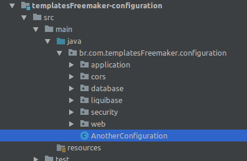
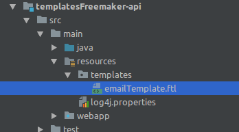
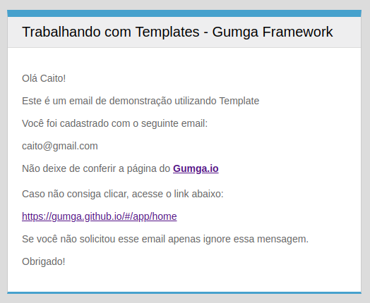

# Templates com FreeMaker

[](https://github.com/GUMGA/frameworkbackend)

O Framework Gumga oferece integração com o gerenciador de templates FreeMaker, isso faz com que seja demasiadamente facilitada a criação e manipulação de modelos prontos de código.
> Para saber mais sobre o FreeMaker visite a página oficial [Clicando Aqui](https://freemarker.apache.org/)

Resumidamente, é possível criar trechos de código com variáveis que são inseridas no modelo em tempo de execução, veja o exemplo na imagem abaixo:<br>


No nosso exemplo criaremos um modelo de email em HTML para ser enviado sempre que uma nova pessoa for cadastrada no sistema. Para isso precisaremos seguir alguns passos que veremos a seguir.

#### Exemplo Funcional

A entidade que manipula e faz o *"parse"* dos dados de entrada com o template pré definido é a **GumgaFreemarkerTemplateEngineService**, porém o acesso aos métodos deve ser feito a partir do *Bean* da classe **GumgaAbstractTemplateEngineAdapter**, por isso antes de qualquer coisa precisamos adicionar o mesmo nas configurações do projeto.

A classe destinada a este fim dentro do Gumga Framework é a **AnotherConfiguration**, que fica no diretório *configuration* do projeto, veja na imagem como fica no nosso exemplo:



Basicamente, o que precisamos fazer é informar à entidade manipuladora qual é o diretório onde os templates estarão alocados e qual a codificação textual a ser utilizada.

Adicionamos o seguinte trecho de código:
```java
@Bean
@Autowired
public GumgaAbstractTemplateEngineAdapter templateEngineService(GumgaValues values) throws TemplateEngineException {
    GumgaFreemarkerTemplateEngineService engine = new GumgaFreemarkerTemplateEngineService(values.getTemplatesFolder(), "UTF-8");
    engine.init();
    return engine;
}
```
> Por padrão os templates utilizados dentro do Framework ficam na pasta **user.home/gumgafiles/templates** por isso temos um método que retorna esse diretório automáticamente, e a codificação textual que utilizaremos no nosso exemplo será "UTF-8"<br>
Teoricamente poderiamos modificar o diretório de alocação dos arquivos de template, porém desencorajamos fortemente essa prática pois o Framework faz a cópia dos arquivos do contexto da aplicação para o diretório que definimos, falaremos mais sobre isso adiante.

#### Definindo um Template
Agora o próximo passo é definir os modelos que utilizaremos, para nosso exemplo utilizaremos um trecho de código HTML:

```HTML
<!DOCTYPE html>
<html>
<head>
    <meta charset="UTF-8">
</head>
<body>
<div style="background-color: #ddd; font-family: Helvetica Neue,Helvetica,Arial,sans-serif;font-size: 14px;color: #666;margin: 0 auto;
             padding: 20px;">
    <center>
        <div style="text-align: left; max-width: 500px;border-left: double 1px #ccc;border-right: double 1px #ccc;border-top: 10px solid #43a4d0;
                     border-bottom: 3px solid #43a4d0;">
            <div style="padding: 10px 20px;color: #000;font-size: 20px;background-color: #efefef;border-bottom: 1px solid #ddd;">
                Trabalhando com Templates - Gumga Framework
            </div>
            <div style="padding:20px;background-color:#fff;line-height:18px">
                <p> Olá ${nome}!
                <p>Este é um email de demonstração utilizando Template</p>
                <p>Você foi cadastrado com o seguinte email:</p>
                <p>${email}</p>
                <p>Não deixe de conferir a página do
                    <a href="${url}” target=" _blank">
                    <strong>Gumga.io</strong><br><br>
                    </a> Caso não consiga clicar, acesse o link abaixo:</p>
                <p><a href="${url}" target="_blank"> ${url} </a></p>
                <p>Se você não solicitou esse email apenas ignore essa mensagem.</p>
                <p>Obrigado!<br>
            </div>
        </div>
    </center>
</div>
</body>
</html>
```
Salvaremos este documento como **"emailTemplate.ftl"** no diretório <br> /templatesFreemaker/templatesFreemaker-boot/src/main/resources/templates<br>
Observe que não o salvamos na pasta que informamos ao gerenciador de template, mas sim no diretório raiz do contexto da aplicação, isso porque o Framework Gumga prevê que todos os templates devem estar por padrão dentro do diretório do projeto, e por isso ele se encarrega de fazer uma cópia dos arquivos de template para a pasta do usuário (diretório que informamos ao gerenciador)

> Uma informação importante é que dependendo do container que estiver sendo utilizado para "subir" a aplicação, o contexto da aplicação poderá ser a pasta API (nomeDaAplicação-api), logo devemos criar salvar os arquivos .ftl dentro desse diretório. Segue exemplo:


#### Utilizando um Template

Para utilizar o modelo que criamos, vamos chamá-lo em um método na Service:
 ```java
 public String sendMail(Pessoa pessoa) {

     Map<String, Object> map = new HashMap<>();

     //Criando o conjunto de dados a serem associados ao template
     map.put("nome", pessoa.getNome());
     map.put("email", pessoa.getEmail());
     map.put("url", "https://gumga.github.io/#/app/home");

     try {
         String htmlTemplate = templateEngineService.parse(map, "emailTemplate.ftl");
         System.out.println(htmlTemplate);
         emails.add(htmlTemplate);
         return htmlTemplate;
     } catch (TemplateEngineException e) {
         e.printStackTrace();
         return null;
     }
 }
 ```

Observe que utilizamos o método *parse(...)* para atribuir o código gerado à string *htmlTemplate*. O objeto *templateEngineService* é uma injeção da classe *GumgaAbstractTemplateEngineAdapter*, segue o exemplo:
```java
@Autowired
private GumgaAbstractTemplateEngineAdapter templateEngineService;
```

Sobrescrevemos o método *save(...)* para que pudessemos invocar o método acima quando uma nova Pessoa for cadastrada.<br>

Podemos então fazer um novo cadastro por requisição
Método: POST
Rota:
```
http://*servidor*/templatesFreemaker-api/api/pessoa
```
RequestBody:
```json
{
	"nome":"Caito",
	"email":"caito@gmail.com",
	"senha":"qwe123",
	"sobrenome":"Silva"
}
```

Como resposta dessa requisição obteremos o objeto salvo, e o stack trace do console vai exibir o nosso email pronto para ser enviado:
```html
<!DOCTYPE html>
<html>
<head>
    <meta charset="UTF-8">
</head>
<body>
<div style="background-color: #ddd; font-family: Helvetica Neue,Helvetica,Arial,sans-serif;font-size: 14px;color: #666;margin: 0 auto;
             padding: 20px;">
    <center>
        <div style="text-align: left; max-width: 500px;border-left: double 1px #ccc;border-right: double 1px #ccc;border-top: 10px solid #43a4d0;
                     border-bottom: 3px solid #43a4d0;">
            <div style="padding: 10px 20px;color: #000;font-size: 20px;background-color: #efefef;border-bottom: 1px solid #ddd;">
                Trabalhando com Templates - Gumga Framework
            </div>
            <div style="padding:20px;background-color:#fff;line-height:18px">
                <p> Olá Caito!
                <p>Este é um email de demonstração utilizando Template</p>
                <p>Você foi cadastrado com o seguinte email:</p>
                <p>caito@gmail.com</p>
                <p>Não deixe de conferir a página do
                    <a href="https://gumga.github.io/#/app/home” target=" _blank">
                    <strong>Gumga.io</strong><br><br>
                    </a> Caso não consiga clicar, acesse o link abaixo:</p>
                <p><a href="https://gumga.github.io/#/app/home" target="_blank"> https://gumga.github.io/#/app/home </a></p>
                <p>Se você não solicitou esse email apenas ignore essa mensagem.</p>
                <p>Obrigado!<br>
            </div>
        </div>
    </center>
</div>
</body>
</html>
```
> Criamos uma rota que retorna uma lista com o conteúdo dos "emails enviados"<br>
Método: GET<br>
Rota: ```
http://localhost:8080/templatesFreemaker-api/api/pessoa/emails
```

Executando o código HTML gerado em um navegador, temos o seguinte:


License
----

LGPL-3.0


**Free Software, Hell Yeah!**
